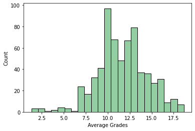
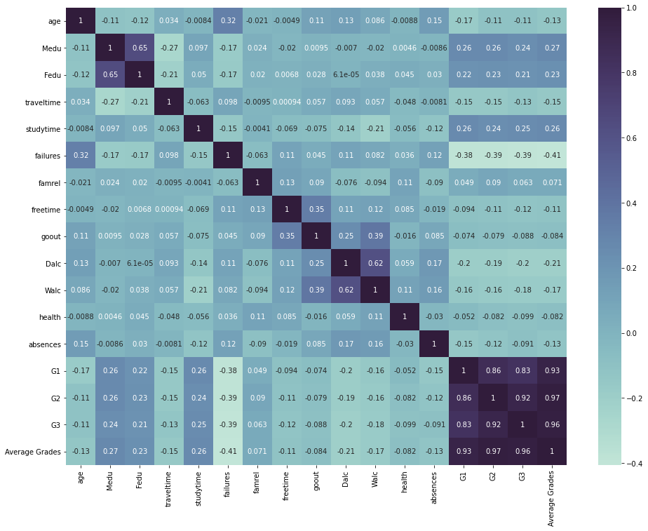
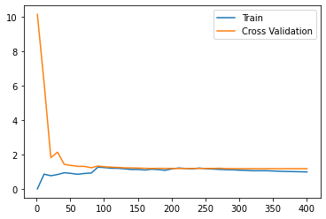
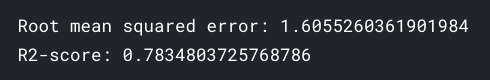
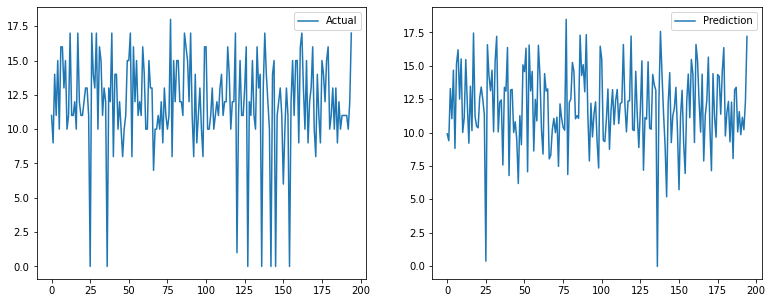

# predict-students-grades

Here [Student Performance Data Set](https://www.kaggle.com/larsen0966/student-performance-data-set) dataset by [Data-Science Sean](https://www.kaggle.com/larsen0966) is used to perform `EDA` and create a `machine learning model` that can predict student's final grades i.e. Tthe goal is to predict `G3` using `G1` and `G2`.

## Findings

> `age` has low positive correlation with `failure`
>
> `Medu` & `Fedu` has moderate positive correlation & they both have low positive correlation with `grades`
>
> `studytime` & `grades` have a low positive correlation
>
> `failure` has low negative correlation with `grades`
>
> `freetime` has low positive correlation with `goout`
>
> `goout` has low positive correlation with `Walc`
>
> `Walc` has moderate positive correlation with `Dalc` and they both have negligible negative correlation

## Model performance

**Learning curve**

**Loss and R2 square metrics**

**Actual Vs Predicted values**

